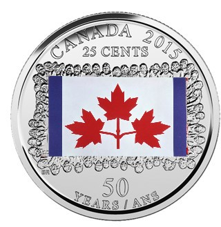
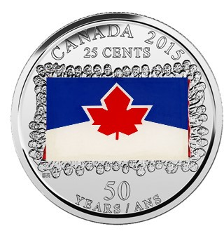
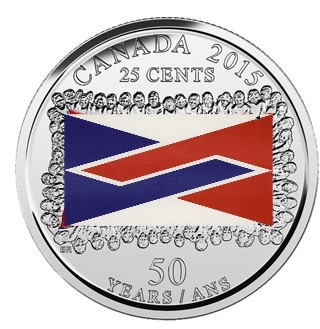
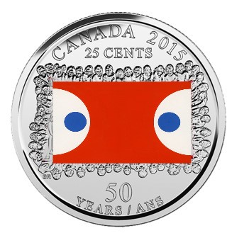

# Fracturing Canadian Identity

Much of what is considered to be quintessentially Canadian in the 21st century has a relatively short history dating back to the Cold War: The Charter of Rights and Freedoms, the Constitution, the National Anthem, and the Canadian Flag to name a few. Very seldom do we explore how these symbols came about and whether or not they actually represent all Canadians.

**It’s time to flip the coin and learn more about how the red maple leaf flag came to be and the controversy it sparked.** 

*     *     *     *  

While it may seem like a no-brainer that the red maple leaf represents Canada, not everyone felt that way when it was proposed as the design for our flag. Indeed, the whole concept of a new flag, independent from the British Empire sparked bitter debate. For the better part of two years the Canadian Government anxiously waited for a decision from the parliamentary committee in charge of receiving submissions from Canadians. Designs were submitted by the young and the old, they were even assigned as class projects. Although maple leaves were the feature of many flag designs there were an equal amount of designs that featured other Canadian icons: geese, fleur-de-lys, beavers and so on. There were also more abstract submissions that incorporated the northern lights or relied on specific colours for meaning (red: for British descendants and blue: for French descendants).

Many Canadians were excited at the prospect of a new symbol for Canada and hoped it would represent the newly emerging Canadian identity. However, there were Canadians who viewed the entire process as blasphemous: they already had a flag and they were not just Canadian, they British-Canadians and proud of it. So, who was right? Who won the debate? And did we end up with a flag representative of our communities?

Well, the short answer is that both sides were right, no one won the debate and no, we did not get a flag that represented our communities. In the 1960s when this debate occurred Canada was still a very young project and most people living in Canada did not consider themselves Canadians, but more so as hyphenated Canadians (British-Canadians, French-Canadians, Italian-Canadians, Jewish-Canadians). So, the idea of creating a new flag was an exciting nation-building project for some and a terrifying undoing of identity for others. In terms of the red maple leaf flag, in many ways it was a victory to have created a new flag and to have it hoisted on Parliament Hill in advance of the centennial in 1967, but it also failed to represent a uniquely Canadian identity. How did it fail? The flag itself is based on the royal colours assigned to Canada from the King in 1925: red and white. The singular maple leaf was extracted from the tri-maple leaves that had become a distinct symbol of the Canadian military and were featured on the Red Ensign. Moreover, the maple leaf only grows in the provinces of Quebec and Ontario, further replicating many criticisms of nation-building focussing solely on these two provinces.

There were many trajectories for the Canadian flag design just as there are many different experiences of Canadian-ness and identity. And very seldom do we take a moment to interrogate this. If you could design your own flag for Canada, what would it look like? 

*     *     *     *   

If I were able to design a coin in commemoration of the Flag Debate I would release a series of coins with various designs submitted by Canadians.

