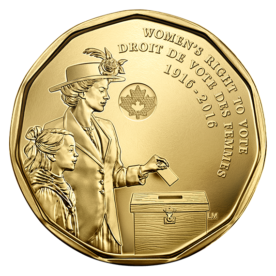

# Creating an Inclusive Timeline

100 years of women’s voting rights huh? In 2016, the Government of Canada decided to commemorate the 100th anniversary of women’s right to vote by commissioning a coin.  The design of the coin features an adult woman and a young girl at a ballot box casting her vote, symbolically linking past female voters with future female voters. So, who or what are we commemorating with this coin? How does your perspective change when you learn that women were not considered people until 1929—thirteen years after the date this coin celebrates?

**It’s time to flip the coin and uncover the broader histories and narratives hidden behind this commemoration of women’s voting rights.** 

*     *     *     *  

Firstly, through a visual analysis of this coin we can read the woman on the obverse of the coin as middle or upper-class. Her clothing, specifically her jacket and her hat signal British influences along with her hairstyle. Moreover, the clothing and the hairstyle of the young girl also help us make assumptions about her class. What are viewers being asked to see or read into these two figures? Are they meant to stand in symbolically for all women? The coin itself tells viewers that this is a commemoration of women’s voting from 1916-2016. But which women?

We can only answer the previous questions by digging into the history of women’s rights and asking the question: what happened in 1916? After decades of suffrage and lobbying to earn the right to vote and hold office, in 1916, women from the prairies (Manitoba, Saskatchewan, Alberta) won the right to vote. Quebecois women did not win the right vote until 1940. This means that for twenty-four of the hundred years celebrated on this coin not all women could vote. Furthermore, women of colour (and often men of colour) were not allowed to vote until after the Second World War. It was not until 1960 that franchise was extended to Indigenous communities leaving Canada with a long history of exclusionary politics rather than inclusionary practices. 

*     *     *     *   

If I were to re-design the coin, I might do one of two things: I would change the dates or clarify the title. To change the timeline, I would make the coin read: “Women’s Right to Vote” 1916-1960. Alternatively, if I were to tweak the title, I would write something like: “Struggling for the Vote” 1916-2016. 

